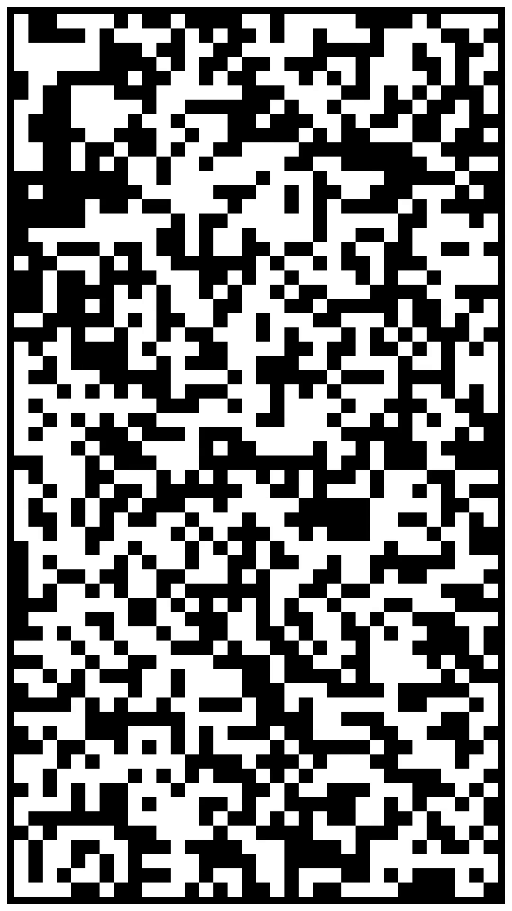
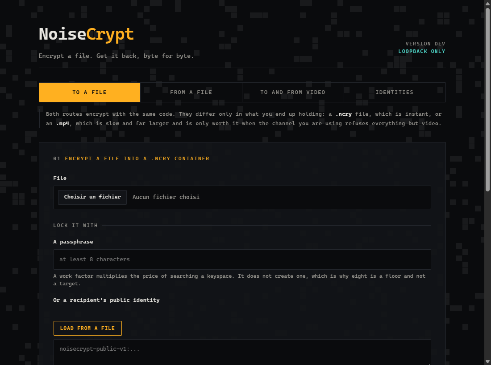
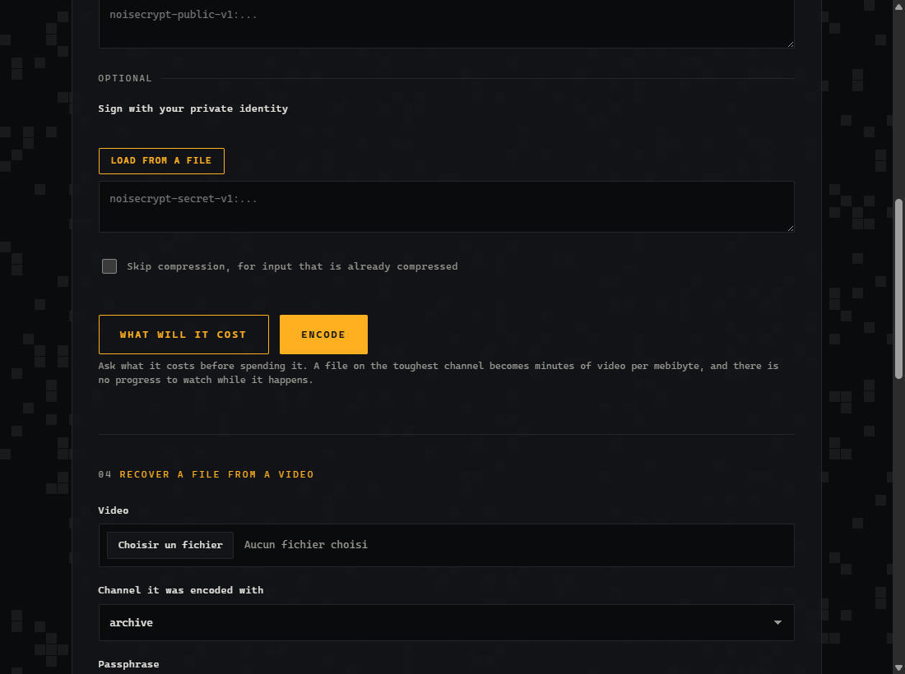
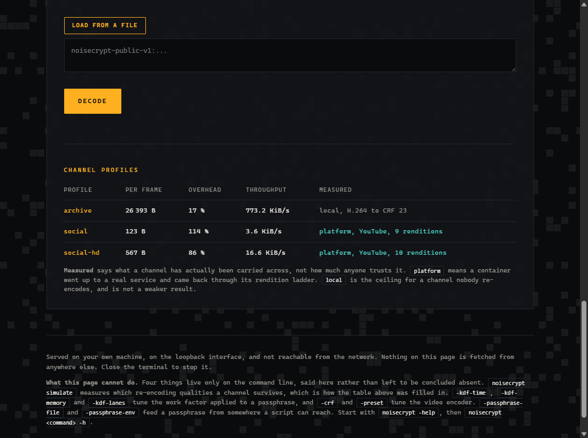
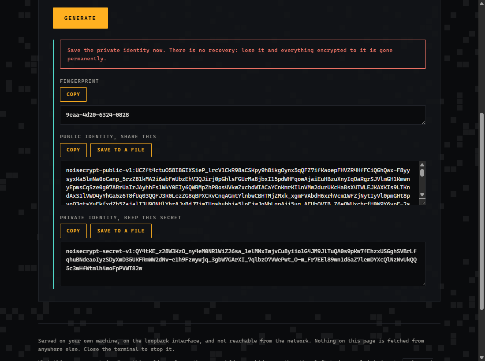

# NoiseCrypt

**Turn any file into a video. Send the video anywhere. Get the file back, byte for byte.**

<p align="center">
  
</p>

That picture is a file. Not a picture *of* a file, not an illustration: those squares **are**
the bytes. Play fourteen hundred of them at thirty a second and you have a video you can
upload anywhere. Download it later and NoiseCrypt hands you the original file back,
identical to the last bit.

It is encrypted the whole way, and it is built to survive being crushed by whatever the
video travelled through.

> We uploaded files to YouTube as unlisted Shorts. YouTube re-encoded each one into around
> ten different versions, shrinking one of them from 1080 pixels wide down to 144 and
> compressing it to a fraction of its original bitrate.
>
> **Every single version gave the file back perfectly.** [See the numbers.](#the-proof)

---

## Contents

- [Why would anyone do this](#why-would-anyone-do-this)
- [Start here: your first encrypted file](#start-here-your-first-encrypted-file)
- [Getting it back](#getting-it-back)
- [Turning a file into video](#turning-a-file-into-video)
- [Sending something to another person](#sending-something-to-another-person)
- [What makes this one different](#what-makes-this-one-different)
- [How it works, in plain terms](#how-it-works-in-plain-terms)
- [The proof](#the-proof)
- [The encryption](#the-encryption)
- [What it does not do](#what-it-does-not-do)
- [The command line](#the-command-line)
- [Install](#install)

---

## Why would anyone do this

Because video goes places files cannot.

Plenty of channels will happily accept a video and refuse everything else. A messaging app
that strips attachments. A platform with no file hosting. A workflow where the only thing
that reliably survives is a clip. Video is the universal envelope of the modern internet,
and NoiseCrypt is a way to put something inside it.

There is also a longevity argument. An `.mp4` is one of the most boringly well supported
formats ever made. Software that can play a video will still exist long after the
proprietary archive format you were counting on has stopped shipping a reader.

And sometimes the honest answer is curiosity. Squeezing data through a channel designed for
something else is a satisfying engineering problem, and this one has a clean way to tell
whether you have solved it: either the file comes back identical or it does not.

**One thing to be clear about.** Using someone's video platform as free file storage almost
certainly breaks their terms of service. NoiseCrypt does not care what you point it at, but
you should read the rules of wherever you are uploading.

---

## Start here: your first encrypted file

You do not need to know anything, and you do not need to type a command.

### 1. Get the program

Download the file for your system from the
[releases page](https://github.com/bzhzion/noisecrypt/releases). That is the whole
installation: one file, nothing to set up, no account, no configuration.

### 2. Double-click it

A window opens in your browser.



A black terminal window opens alongside it. **Leave it open.** That window is the program;
it is what serves the page. Closing it stops everything.

### 3. Pick your file and choose a passphrase

Click **Choose file** and pick anything. A document, a photo, a zip, it makes no
difference.

Then type a **passphrase** in the box. This is the part that matters, so here is exactly
what it is:

**You invent it.** The program does not give you one. It is the only thing that will reopen
your file later.

**A whole phrase beats a clever word.** `my cat sleeps on the radiator` is far stronger than
`Xk9#mP2!`, easier to remember, and much harder to break. Spaces are allowed and are taken
exactly as you type them, so a stray space at the end will stop it opening later.

**If you lose it, the file is gone.** Permanently. There is no reset link, no recovery, and
nobody to call. That is not a missing feature, it is the point: anything that could get you
back in could get somebody else in.

The eight character minimum is a floor, not a target. Eight characters is weak.

### 4. Click Encrypt

The page confirms:

> Encrypted. Downloaded holiday-photos.zip.ncry.

The file lands in your usual downloads folder. The `.ncry` on the end is your file inside a
locked container.

That is it. You have encrypted something.

---

## Getting it back

Second tab, **From a file**. Pick the `.ncry`, type the same passphrase, click **Decrypt**.

You get your file back with its original name, because the name was stored inside the
container too. The `.ncry` outside is only there to help *you* recognise it; you can rename
it to anything you like before sending it and it will still open correctly.

If it refuses and you are certain of your passphrase, check for a **space at the end**,
especially if you pasted it from somewhere. The program will not tell you why it failed,
deliberately: an error message that distinguished "wrong passphrase" from "damaged file"
would be helping whoever is guessing.

---

## Turning a file into video

This is the part NoiseCrypt exists for. Third tab, **To and from video**.



It works exactly like the first tab: pick a file, type a passphrase. The encryption is
**identical**, done by the same code. The only difference is what you end up holding: a
`.ncry` file, or an `.mp4`.

### Ask before you spend

Notice there are two buttons. The left one, **What will it cost**, tells you how many
frames and how many minutes of video your file becomes, before making any of it.

Use it. Turning a file into video is **slow and enormous**: on the toughest channel, a
single megabyte becomes several minutes of footage. Better to find that out in half a
second than after a twenty minute wait.

There is no progress bar during the encode, and there will not be one. The encoder hands
frames to the video muxer with no total to divide by, so any bar drawn there would be an
animation rather than a measurement. The estimate is the honest version of the same
information.

### Choosing a channel

The **Channel** dropdown is the one real decision, and the table at the bottom of the tab
explains it:



| Channel | Use it for | Speed |
|---|---|---|
| `archive` | A disk, a USB stick, object storage, a torrent. Nothing re-encodes it | 773 KiB/s |
| `social-hd` | A platform, when you can download the video back in decent quality | 16.6 KiB/s |
| `social` | A platform, toughest setting, readable even at 144 pixels wide | 3.6 KiB/s |

`archive` is the default and is two hundred times faster than `social`, but it would not
survive a platform for a second. If you are uploading somewhere that re-encodes, pick one of
the other two.

### Getting the file back out

Lower down the same tab: pick the video, pick the channel it was encoded with, type the
passphrase.

Picking the wrong channel is the easiest mistake to make here, so the program says so
plainly instead of shrugging:

> this video is 1920x1080 and the social profile encodes at 1080x1920, so either it has been
> rescaled by a platform or the profile is wrong

---

## Sending something to another person

A shared passphrase works, but it has to get to them somehow, and that is the weak part.
There is a better way, and it needs no shared secret at all.

### The idea, with a padlock

Imagine you make a crate of open padlocks, all identical, and hand them out everywhere: to
friends, on your website, in your email signature. Anyone can take one, lock a box with it,
and send it to you.

**You are the only person with the key that opens them.**

The open padlock is your **public identity**. The key is your **private identity**. Someone
intercepting a padlock learns nothing, because a padlock only closes.

### Making one

Fourth tab, **Identities**, one button.



You get three things:

**A fingerprint**, like `9eaa-4d20-6324-0828`. A short summary you can read aloud over the
phone so the other person can check they received *your* identity and not somebody else's.

**A public identity**, the long one. Give it to anyone. Publish it. It is meant to be seen.

**A private identity**, the short one. Nobody. Ever.

Click **Save to a file** under the private one, right now, before anything else. That file
is the only copy, it only exists on that screen, and losing it loses everything ever
encrypted to it. Put it somewhere you back up.

### Using it

They give you their **public** identity. You paste it into the *Or a recipient's public
identity* box on the first tab, or click **Load from a file** if they sent you one. You type
no passphrase at all. Only they can open the result.

The two halves go to different places, which is the bit that trips everyone up the first
time:

| Which half | Where it goes | What it does |
|---|---|---|
| **Their public** | First tab, *recipient's public identity* | Locks it for them |
| **Your private** | Second tab, *your private identity* | Opens what was sent to you |

### Proving it came from you

Under *Optional* on the first tab there is **Sign with your private identity**. Paste
**your own** private half there and the container carries proof you produced it. Leave it
empty and it goes out anonymous, perfectly encrypted, but with nothing saying who made it.

So on that one page you use two different keys: **their** public to lock, **your** private
to sign. Confusing the first time, logical afterwards.

The half that actually protects you is on the receiving side, under **Demand a signature**.
Tick the box and an unsigned container is *refused* rather than opened with a note. Add an
identity and only that person's signature will do.

The difference is real. Without it, somebody can strip a signature off and the file still
opens, with a small message nobody reads. Removing a signature would then be exactly as
effective as forging one, which empties the idea of its meaning.

---

## What makes this one different

Turning files into video is not a new idea. Several tools do it, some of them good. Here is
what this one does that they do not, and what it simply does properly.

### The encryption is not something you can forget to switch on

Every other tool in this space treats encryption as an option, or leaves it to you. The
project this one replaced said "encrypt it beforehand" in its documentation, which is a
booby trap with a long fuse: nobody does, and the one time it matters the video has been
public for a month.

**NoiseCrypt has no mode that skips it.** There is no `--encrypt` flag to remember and no
plaintext path to fall into, because there is no plaintext path at all. The file name, the
size and the modification date go inside the encryption too, so the video reveals that
*something* is there and never *what*.

That is the difference between a tool that can be used safely and a tool that is safe.

### It is the only one that claims to survive a platform, and shows the numbers

This is the hard part of the problem, and it is where the others stop.

Read their documentation and most of them say it openly: they need a platform which does
**not** re-encode. Lossless codecs, lossless containers, "upload this to any lossless video
platform". On YouTube, which re-encodes everything into ten different versions, that approach
does not work at all. The most capable of them can send H.264 to a platform, and makes no
claim about what comes back.

That is the honest state of the art, and it is worth saying without sneering: surviving a
platform is genuinely difficult, and choosing not to promise it is a defensible decision.

NoiseCrypt is built for the opposite case, and the channel table has a column called
**Measured** that does not say how confident anyone feels. It says what was actually done.

`platform, YouTube, 10 renditions` means a container really went up to YouTube, really came
back through every version YouTube produced, and really decoded byte for byte. Down to 144
pixels wide, at a twentieth of the original bitrate.

`local, H.264 to CRF 23` for `archive` is not a weaker result, it is the ceiling of what that
channel's premise allows: it targets media nobody re-encodes, so there is no platform for it
to cross.

### Everything here was measured, and the wrong measurements are written down too

Nothing here claims a figure it has not produced, and no figure is written next to the code
it describes, because a number kept in step by hand eventually stops being true. The
overhead percentages in that table are derived from the actual error-correcting layout at
runtime; one of them was declared as 40% and turned out to be 114%, which is why they are
now calculated rather than typed.

The more useful habit is the opposite one. When a measurement said a denser channel was
possible and a second measurement showed the first was misleading, the second won **and both
are in the [changelog](CHANGELOG.md)**, along with the reason the first one lied. Three
wrong diagnoses of the same bug are in there. So is a control that reported success without
having checked anything, and how that was caught.

You are not being sold a clean story. You are being handed the workings.

### Nothing leaves your machine, including this page

The interface is served by the program itself, on your own computer, on an address the
network cannot reach.

**Not one thing on that page is loaded from anywhere else.** No fonts, no scripts, no
analytics, no update check. A page that fetches a font tells whoever serves that font that
you are using this tool, and that alone is more than this program is willing to say about
you.

### It tells you what it cannot do

The bottom of the interface lists the four things that only exist on the command line,
rather than letting you conclude they do not exist. When a frame is lost, the count is
reported even on a successful decode, because redundancy silently absorbing damage is also
exactly what hides a channel getting worse.

There is no fake progress bar. There is no reassuring green tick on an operation that was
not verified. Where something has not been tested, the tool says so.

### And the cryptography is current, which is table stakes rather than a boast

Key exchange is hybrid X25519 and ML-KEM-768, so breaking it means breaking both. That is
the right way to do it in 2026, and it is **not a differentiator**: the good file encryption
tools got there too. [age](https://github.com/FiloSottile/age) ships post-quantum recipients,
[Kryptor](https://www.kryptor.co.uk/) has hybrid ML-KEM key exchange. If that is all you
need, use one of those; they are excellent and they are open source.

Where NoiseCrypt goes a step further is signatures, which are hybrid too, Ed25519 and
ML-DSA-65, both produced and both required. `age` has no signatures at all by design, and
Kryptor's are classical Ed25519. Worth knowing, not worth a headline.

The point of saying this plainly: a project that oversells its cryptography invites you to
distrust everything else it tells you, and the parts above are the ones that are actually
unusual.

---

## How it works, in plain terms

### Step one: the file becomes a picture

Imagine a chessboard. Each square is black or white, and each square carries one bit of your
data. Fill the board and you have a frame. Fill fourteen hundred boards and play them at
thirty per second and you have a video.

That is genuinely it. The picture at the top of this page is your file, drawn as squares.

### Step two: the squares have to survive being flattened

A video platform does not store what you gave it. It shrinks it, blurs it, throws away detail
to save bandwidth, and re-compresses it two or three times on the way to a viewer's screen.
Small squares blur into their neighbours and the bits turn to mush.

So the squares are deliberately large, and their size is chosen to match how platforms shrink
video. NoiseCrypt draws them at 30 pixels, because a platform scaling a 1080 pixel wide video
down to 576 is dividing by 15 and multiplying by 8, and 30 survives that arithmetic as exactly
16 pixels. No fractional pixels, no bleeding edges. Pick the wrong size and every square
smears into the next.

### Step three: redundancy, so damage does not matter

Some squares will still be read wrong. Whole frames will vanish, because platforms change
frame rates and drop frames to do it.

So your file is spread across the video with mathematical redundancy, the same family of
technique that lets a scratched CD play or a torn QR code still scan. There are two layers,
because video breaks data in two unrelated ways: scattered wrong squares inside a frame, and
entire frames going missing. One layer repairs each.

The decoder does not need a perfect video. It needs enough of one.

### Step four: it was encrypted before any of that happened

Before your file is ever drawn as squares it is compressed and encrypted. Not as an option you
can forget to switch on: there is no mode that skips it.

The file name, its size and the date you last touched it are encrypted too. The video reveals
that *something* is inside, never *what*.

---

## The proof

Talk is cheap on this kind of claim, so here is a real round trip.

A 160 KiB file of pure random bytes, chosen because random data cannot be compressed and is
therefore the hardest case. Encoded into a 45 second vertical video, uploaded to YouTube as
an unlisted Short, then every single version YouTube generated was downloaded and decoded.

| What YouTube served | Codec | Shrunk to | Squares became | Result |
|---|---|---|---|---|
| 1080x1920 | H.264, VP9, AV1 | full size | 30 px | perfect |
| 720x1280 | H.264, VP9 | 67 % | 20 px | perfect |
| 608x1080 | AV1 | 56 % | 16.9 px | perfect |
| 480x854 | H.264 | 44 % | 13.3 px | perfect |
| 360x640 | H.264 | 33 % | 10 px | perfect |
| 240x426 | H.264 | 22 % | 6.7 px | perfect |
| 144x256 | H.264 | 13 % | 4 px | perfect |

"Perfect" means the recovered file had the same SHA-256 hash as the original. Not similar.
Identical.

The most extreme row is worth sitting with. At 144x256, each of those carefully sized 30 pixel
squares had been crushed to about 4 pixels, and the whole clip was down to 199 kbit/s. It
still worked.

The test was repeated with `social-hd`, which uses squares half the size and carries four and
a half times as much data. **All ten renditions came back identical**, down to 144x256.

**What this does not prove.** One file, one platform, one day. It says nothing about other
platforms, about hour-long videos where frame rates get converted differently, or about what
YouTube's pipeline will do next year. Anyone who tells you a single successful test is a
guarantee is selling something.

---

## The encryption

The reference list, for anyone who wants to check rather than take a word for it. None of it
is exotic and that is the intention: a video codec is an unusual thing to build, a
cryptographic primitive is not, and this project wrote none of the latter.

**Key exchange** is hybrid X25519 and ML-KEM-768 (FIPS 203). Both shared secrets go into one
transcript, so the result is safe as long as *either* holds. This is the standard approach
to post-quantum migration and several good tools do it; see
[the note above](#and-the-cryptography-is-current-which-is-table-stakes-rather-than-a-boast).

**Signatures**, when you use them, are hybrid Ed25519 and ML-DSA-65 (FIPS 204). Both produced,
both required to verify.

**The container** is XChaCha20-Poly1305 in chunks, so a damaged byte spoils one chunk instead
of the whole file. **Passphrases** go through Argon2id, which makes each guess expensive.

**Signatures cover the recipient's fingerprint**, which closes a subtle hole: a recipient
cannot re-encrypt a still-valid signed payload to a third party and have it verify there.

**Metadata is inside the encryption**, and there is a test that fails if the file name ever
appears in the sealed bytes.

---

## What it does not do

**This is not steganography.** The video does not pretend to be anything. Anyone who looks at
it sees grey static and knows something odd is going on. There is no deniability, and this
document will not pretend otherwise.

**It is slow, on purpose, when you ask it to be.** The toughest channel trades throughput for
survival. That is the deal.

**Only YouTube has been measured.** Two of the three channels say so in the table. The third
says `local`, which is what its premise allows.

**Your keys are your problem.** There is no recovery, no escrow, no backdoor. That is a
feature, and it is also a responsibility.

---

## The command line

Everything the interface does, the command line does too, and a few things more. Nothing hides
behind a menu, so it can go in a script or a nightly job.

```sh
# See everything, including which commands need FFmpeg installed
noisecrypt -help

# The two commands that matter
noisecrypt encode -in report.pdf -out report.mp4
noisecrypt decode -in report.mp4 -out report.pdf

# The safe without the video
noisecrypt seal -in report.pdf
noisecrypt open -in report.pdf.ncry

# What it will cost, before it costs it
noisecrypt estimate -in report.pdf
```

You are prompted for the passphrase and what you type is not shown. There is deliberately no
`-passphrase` flag: anything typed on a command line lands in your shell history and is
visible to every other user through the process list. For scripts, use `-passphrase-file` or
`-passphrase-env`.

### Keys that look after themselves

```sh
# Generates, protects and stores an identity in ~/.noisecrypt
noisecrypt keygen

# ...and from then on, nothing has to say where the key is
noisecrypt open -in message.ncry
```

`keygen` asks for a passphrase to protect the stored key, with `-no-passphrase` if you would
rather not. A key kept somewhere predictable is a convenience when what is found there is
locked and an invitation when it is not, so the lock is the default rather than the thing you
have to remember to ask for.

On Windows the stored key gets a real owner-only permission entry, not just a Unix mode that
platform quietly ignores.

Four things live only here: `noisecrypt simulate`, which measures which re-encoding qualities
a channel survives and is how the table above was filled in; the Argon2id settings; the video
encoder settings; and reading a passphrase from a file or the environment.

---

## Install

Grab a binary from the [releases page](https://github.com/bzhzion/noisecrypt/releases). One
file, six platforms, no installer and no dependencies.

**FFmpeg is needed for the video commands only**, which is `encode`, `decode` and `simulate`.
Everything else, including all the encryption, needs nothing installed at all. The interface
tells you once, when the page loads, rather than failing after you have chosen a file and
typed a passphrase.

Building it yourself needs Go 1.26.6 or newer and nothing else. There is no C toolchain, no
node_modules, no build step for the interface: `go build ./cmd/noisecrypt` and you are done.

---

## For developers

`docs/FORMAT.md` is the normative specification, with test vectors, and it states plainly
where a fixed test vector was deliberately *not* provided and why.

`CHANGELOG.md` is unusually detailed on purpose. It records the reasoning behind decisions and,
more usefully, the measurements that turned out to be misleading and what replaced them.

Five CI workflows run on every push, including a weekly dependency scan. That last one is the
part that matters: a vulnerability is never published on the day a commit is made, and a
project scanned only when it changes stops being scanned the day it stops changing.

---

## Licence

[BZ-1.1](LICENSE.md), the BREIZHZION Personal Use License. Source available rather than open
source: read it, study it, use it personally. Commercial use and manufacturing for third
parties are reserved. Contact `contact@breizhzion.com`.
